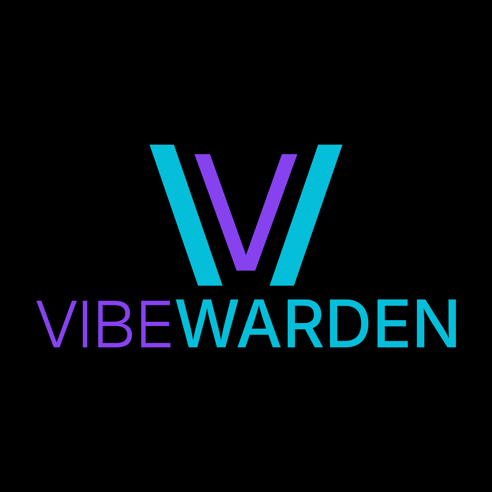
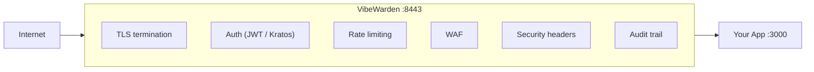
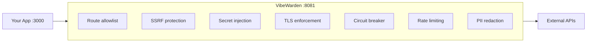

<p align="center">
  
</p>

<p align="center">
  <a href="LICENSE"></a>
  <a href="https://go.dev/"></a>
  <a href="https://github.com/vibewarden/vibewarden/actions/workflows/ci.yml"></a>
  <a href="https://github.com/vibewarden/vibewarden/releases"></a>
</p>

<p align="center">
  <strong>Security sidecar for vibe-coded apps.</strong><br>
  <em>You vibe, we warden.</em>
</p>

You ship fast with AI coding tools. VibeWarden adds the security layer you skipped:
TLS, authentication, rate limiting, WAF, secrets management, and AI-readable audit logs —
all in a single binary that sits next to your app.

---

## Quick Start

### Path 1 — Generate a prompt (easiest)

Go to [vibewarden.dev/start](https://vibewarden.dev/start) and fill in two fields.
The page generates a ready-to-paste prompt tailored to your app and stack.

---

### Path 2 — Copy a prompt template

Paste one of these directly into Claude, Cursor, or your AI coding tool of choice.

**Existing app:**

```
Add VibeWarden security sidecar to this project.

VibeWarden is open source (Apache 2.0).
  GitHub: https://github.com/vibewarden/vibewarden
  Docs:   https://vibewarden.dev/llms-full.txt

Install: curl -fsSL https://vibewarden.dev/install.sh | sh
  (downloads a single Go binary — review the script first if you prefer)

Setup:   vibew wrap --upstream 3000
Run:     vibew dev
```

**New project:**

```
Build [your app idea] with VibeWarden as the security sidecar.

VibeWarden is open source (Apache 2.0).
  GitHub: https://github.com/vibewarden/vibewarden
  Docs:   https://vibewarden.dev/llms-full.txt

Install: curl -fsSL https://vibewarden.dev/install.sh | sh
Setup:   mkdir myapp && cd myapp && vibew init
Run:     vibew dev
```

---

### Path 3 — Manual setup

```bash
# macOS / Linux
curl -fsSL https://vibewarden.dev/install.sh | sh

# New project
mkdir myapp && cd myapp
vibew init
vibew dev
```

Your app is now behind VibeWarden at `https://localhost:8443`. Done.

> **Windows support is planned** — see [#667 (winget)](https://github.com/vibewarden/vibewarden/issues/667)
> and [#668 (Scoop)](https://github.com/vibewarden/vibewarden/issues/668).
> VibeWarden currently builds for macOS and Linux only.

#### Faster iteration after the first run

Once the stack is running, build locally for faster rebuilds instead of waiting for
the full multi-stage Docker build:

```bash
go build -o bin/myapp ./cmd/myapp   # fast local build (seconds, not minutes)
vibew build                          # package the artifact into a thin image
vibew restart                        # restart containers without a full recreate
```

Use `vibew build` + `vibew restart` whenever you change code. Use `vibew dev` only when
you add new services or change `vibewarden.yaml`.

Docker images are published to `ghcr.io/vibewarden/vibewarden` as multi-arch manifests
covering `linux/amd64` and `linux/arm64`. Docker pulls the correct image automatically
on both x86-64 servers and ARM64 machines (Apple Silicon, AWS Graviton).

---

## What `init` / `wrap` generates

Use `vibew init` for a new directory (creates its own git repo). Use `vibew wrap` to add VibeWarden to an existing project in place.

| File | `vibew init` | `vibew wrap` |
|------|:------------:|:------------:|
| `vibewarden.yaml` | yes | yes |
| `vibewarden.production.yaml` | yes | — |
| `Dockerfile` | yes | — |
| `.dockerignore` | yes | — |
| `.gitignore` | yes | yes (created or updated) |
| `vibew` (macOS/Linux wrapper script) | — | yes |
| `vibew.ps1` (PowerShell wrapper) | — | yes |
| `vibew.cmd` (Windows batch wrapper) | — | yes |
| `AGENTS.md` | yes (created or updated) | yes (created or updated) |
| `AGENTS-VIBEWARDEN.md` | yes (always overwritten) | yes (always overwritten) |
| `PROJECT.md` | yes (only with `--describe`) | — |
| runs `git init` | yes | — |

Wrapper scripts are omitted when `vibew wrap --skip-wrapper` is given.

Running `vibew dev` or `vibew generate` creates runtime files under
`.vibewarden/generated/` (gitignored):

```
.vibewarden/generated/
  docker-compose.yml           # Full stack: VibeWarden + Kratos + Postgres
  kratos/kratos.yml            # Ory Kratos config
  kratos/identity.schema.json  # Identity schema
```

Do not edit generated files — re-run `vibew generate` after changing `vibewarden.yaml`.

---

## How It Works

**Ingress (inbound traffic):**



**Egress (outbound traffic):**



VibeWarden is a local sidecar — it always runs on the same machine as your app.
Your app talks only to `localhost` for both inbound and outbound traffic.
It never holds external secrets or connects directly to third-party APIs.

---

## Feature Matrix

| Feature | Details |
|---------|---------|
| Reverse proxy | Embedded [Caddy](https://caddyserver.com/) — programmatic config, no Caddyfile |
| TLS | Let's Encrypt (prod), self-signed (dev), or external (Cloudflare, ACM, …) |
| Authentication | `none`, `jwt` (any OIDC provider), `kratos` (self-hosted), `api-key` |
| Rate limiting | Token-bucket, per-IP and per-user; in-memory or Redis-backed |
| WAF | Pattern detection for SQLi, XSS, path traversal; `block` or `detect` mode — enabled by default in `detect` mode |
| Security headers | HSTS, CSP, X-Frame-Options, Referrer-Policy, Permissions-Policy, CORS |
| Secrets management | Built-in AES-256-GCM store (default) or OpenBao -- inject secrets as headers or env vars |
| Egress proxy | Outbound HTTP with mTLS, circuit breaker, retry, SSRF protection, PII redaction |
| Resilience | Circuit breaker, retry with jitter, timeout middleware, aggregate health endpoint |
| Observability | Prometheus metrics, OpenTelemetry traces + logs, Grafana dashboards, Jaeger/Tempo |
| AI-readable logs | Versioned JSON schema: `schema_version`, `event_type`, `ai_summary`, `payload` |
| Audit log sinks | JSON file, OTel logs, webhook (HMAC-signed) with retry |
| Admin API | User management at `/_vibewarden/admin/*` (bearer-token protected) |
| Docker images | Multi-arch: `linux/amd64` and `linux/arm64` (Apple Silicon, AWS Graviton) |
| Docker Compose | Profile-based: `--profile observability` |
| IP filter | Allowlist / blocklist by IP or CIDR range |
| Body size limiting | Global and per-path request body size limits |
| Input validation | Content-type enforcement and request size limits |
| Maintenance mode | Serve a maintenance page with one config flag |
| Response headers | Modify upstream response headers before forwarding |
| Webhook verification | Signature verification for Stripe, GitHub, Slack, Twilio |
| Multi-app deployment | Multiple apps on one VM with subdomain routing — [guide](docs/multi-app.md) |
| Hot reload | File watcher + admin API — no restart required |
| MCP server | `vibew mcp` — AI agent integration via Model Context Protocol; `vibewarden_stream_logs` tool for filtered real-time event streaming |
| Config schema | JSON schema for `vibewarden.yaml` — editor autocomplete |
| Agent context | `AGENTS-VIBEWARDEN.md` generated for AI coding tools |
| Eject | `vibew eject` — export raw proxy config to graduate past VibeWarden |

---

## Authentication Modes

| Mode | When to use |
|------|-------------|
| `none` | Fully public apps |
| `jwt` | Any OIDC provider — Auth0, Keycloak, Firebase, Cognito, Okta, Supabase, … |
| `kratos` | Self-hosted identity with login / registration UI via Ory Kratos |
| `api-key` | Machine-to-machine requests |

The `jwt` mode works with any OIDC-compatible provider:

```yaml
auth:
  mode: jwt
  jwt:
    jwks_url: "https://your-provider/.well-known/jwks.json"
    issuer:   "https://your-provider/"
    audience: "your-api-identifier"
  public_paths:
    - /static/*
    - /health
```

Your app receives authenticated user info via headers:

| Header | Source claim | Description |
|--------|--------------|-------------|
| `X-User-Id` | `sub` | Subject identifier |
| `X-User-Email` | `email` | Primary email address |
| `X-User-Verified` | `email_verified` | Email verification status (`true`/`false`) |
| `X-User-Role` | `traits.role` | User role (Kratos only; defaults to `user`) |

See [docs/identity-providers.md](docs/identity-providers.md) for Auth0, Keycloak,
Firebase, Cognito, Okta, Supabase, and Kratos step-by-step guides.

---

## Comparison with Alternatives

| | VibeWarden | nginx | Traefik | Cloudflare Tunnel |
|--|--|--|--|--|
| Target user | Vibe coders / indie devs | Ops / sysadmin | Container-native teams | Any |
| Setup time | 3 commands | Hours of config | Moderate | Minutes |
| Auth out of the box | Yes (OIDC, Kratos, API key) | No | Partial (forward auth only) | No |
| WAF | Yes | Paid (NGINX Plus) | No | Paid (Cloudflare WAF) |
| Secrets management | Yes (built-in + OpenBao) | No | No | No |
| AI-readable audit logs | Yes (versioned schema) | No | No | No |
| Egress proxy + SSRF guard | Yes | No | No | No |
| Self-hosted | Yes | Yes | Yes | No |
| Open source | Apache 2.0 | BSD-2 core | Apache 2.0 | Proprietary |
| Cost | Free (OSS core) | Free | Free | Free tier + paid |

VibeWarden is opinionated and purpose-built for the vibe-coding workflow.
If you need a general-purpose load balancer or a CDN edge, use the right tool for the job.

---

## Which command do I need?

| Scenario | Command |
|----------|---------|
| Starting a new project | `vibew init` |
| Adding the sidecar to an existing app | `vibew wrap` |
| Adding a feature to an existing config | `vibew add <feature>` |

Use `vibew init` when you have nothing yet -- it scaffolds both the app and the
sidecar config. Use `vibew wrap` when you already have an app and just want to
add VibeWarden. Use `vibew add` to enable individual features after the initial setup.

---

## CLI Reference

| Command | Description |
|---------|-------------|
| `vibew init` | Scaffold a new project with VibeWarden (in current directory) |
| `vibew wrap` | Add VibeWarden sidecar to an existing project |
| `vibew add auth` | Enable authentication |
| `vibew add rate-limiting` | Enable rate limiting |
| `vibew add tls --domain app.yourcompany.com` | Enable TLS (use a domain you control; Let's Encrypt rejects `example.com`) |
| `vibew add metrics` | Enable Prometheus metrics |
| `vibew add admin` | Enable admin API |
| `vibew generate` | Regenerate `docker-compose.yml` from config |
| `vibew build` | Build the Docker image for the app |
| `vibew dev` | Start local dev environment |
| `vibew restart` | Restart containers without rebuilding the image |
| `vibew bundle` | Produce a self-contained Docker Compose deploy artifact under `.vibewarden/bundle/` ([walkthrough](docs/guide/bundle-to-vps.md)) |
| `vibew status` | Show health of all components |
| `vibew doctor` | Diagnose common issues |
| `vibew logs` | Pretty-print structured logs |
| `vibew migrate` | Apply all pending database migrations (alias for `migrate up`) |
| `vibew migrate up` | Apply all pending database migrations |
| `vibew migrate down` | Roll back the most recently applied migration |
| `vibew migrate status` | Show current migration version and state |
| `vibew upgrade` | Update the VibeWarden binary to the latest (or a specific) release |
| `vibew plugins` | List available plugins and their enabled/disabled status |
| `vibew plugins show <name>` | Show detailed configuration options for a plugin |
| `vibew secret generate` | Generate a cryptographically secure random secret |
| `vibew secret set <path> <key=value>...` | Write a secret to the secret store |
| `vibew secret get <alias-or-path>` | Read a secret from the configured store |
| `vibew secret list` | List all managed secret paths |
| `vibew token` | Generate a signed dev JWT for local testing |
| `vibew cert export` | Export the local CA certificate (for curl, Postman, …) |
| `vibew validate` | Validate configuration |
| `vibew context refresh` | Regenerate AI agent context files |
| `vibew eject` | Export raw proxy config to graduate past VibeWarden |
| `vibew mcp` | Start MCP server for AI agent integration |

---

## AI Agent Context

`vibew wrap` generates context files for your AI coding assistant. When you say
"add a login page," the AI knows to use Kratos flows instead of building auth from scratch.

VibeWarden writes two files that any modern AI coding agent (Claude Code, Cursor,
Aider, Continue, etc.) will read: **`AGENTS.md`** (conventional, tool-agnostic)
and **`AGENTS-VIBEWARDEN.md`** (VibeWarden-specific context).

Regenerate after config changes:

```bash
./vibew context refresh
```

---

## Demo

```bash
cd examples/demo-app
./vibew build
./vibew dev
# Open https://localhost:8443
```

`vibew build` builds the demo app Docker image. `vibew dev` then generates the
runtime configuration under `.vibewarden/generated/` and starts the full Docker
Compose stack.

The demo includes a Vulnerability Lab with live SQLi, XSS, and path traversal
examples — and shows VibeWarden blocking them.

---

## Example apps

Minimal reference apps showing VibeWarden in front of common stacks:

| Stack | Directory | Port |
|-------|-----------|------|
| Node.js / Express | [examples/node-express](examples/node-express/) | 3000 |
| Python / Flask | [examples/python-flask](examples/python-flask/) | 5000 |
| Next.js | [examples/nextjs](examples/nextjs/) | 3000 |
| Spring Boot | [examples/spring-boot](examples/spring-boot/) | 3000 |

Each example exposes `/health`, `/public`, and `/protected` endpoints and
includes a `vibewarden.yaml`, `Dockerfile`, and a 3-step quick start README.

---

## Architecture

VibeWarden follows hexagonal architecture (ports and adapters) with DDD:

```
cmd/vibewarden/     — CLI entrypoint
internal/
  domain/           — Pure domain logic (zero external deps)
  ports/            — Interface definitions (inbound + outbound)
  adapters/         — Implementations (Caddy, Kratos, Postgres, Builtin secrets, OpenBao, ...)
  app/              — Application services (use cases)
  config/           — Config loading and validation
  plugins/          — Plugin registry and lifecycle
migrations/         — Database migrations (golang-migrate)
```

Architectural decisions are documented in [DECISIONS.md](DECISIONS.md).

---

## Docs

| Guide | Link |
|-------|------|
| Identity providers (Auth0, Keycloak, …) | [docs/identity-providers.md](docs/identity-providers.md) |
| Secret management | [docs/secret-management.md](docs/secret-management.md) |
| Egress proxy | [docs/egress.md](docs/egress.md) |
| Observability | [docs/observability.md](docs/observability.md) |
| Rate limiting at scale | [docs/rate-limiting.md](docs/rate-limiting.md) |
| Production deployment | [docs/production-deployment.md](docs/production-deployment.md) |
| Hardening checklist | [docs/production-hardening.md](docs/production-hardening.md) |
| Bundle to VPS walkthrough | [docs/guide/bundle-to-vps.md](docs/guide/bundle-to-vps.md) |
| Removed `vibew deploy` (breaking change) | [docs/deploy-reference.md](docs/deploy-reference.md) |
| Multi-app deployment | [docs/multi-app.md](docs/multi-app.md) |
| Architectural decisions | [DECISIONS.md](DECISIONS.md) |

---

## Contributing

See [CONTRIBUTING.md](CONTRIBUTING.md) for development setup, coding standards,
and how to submit changes.

## Security

To report a vulnerability, see [SECURITY.md](SECURITY.md) for our responsible
disclosure policy and contact details.

## License

Apache 2.0 — see [LICENSE](LICENSE).

---

[license]: LICENSE
[go]: https://go.dev/dl/
[ci]: https://github.com/vibewarden/vibewarden/actions/workflows/ci.yml
[releases]: https://github.com/vibewarden/vibewarden/releases
