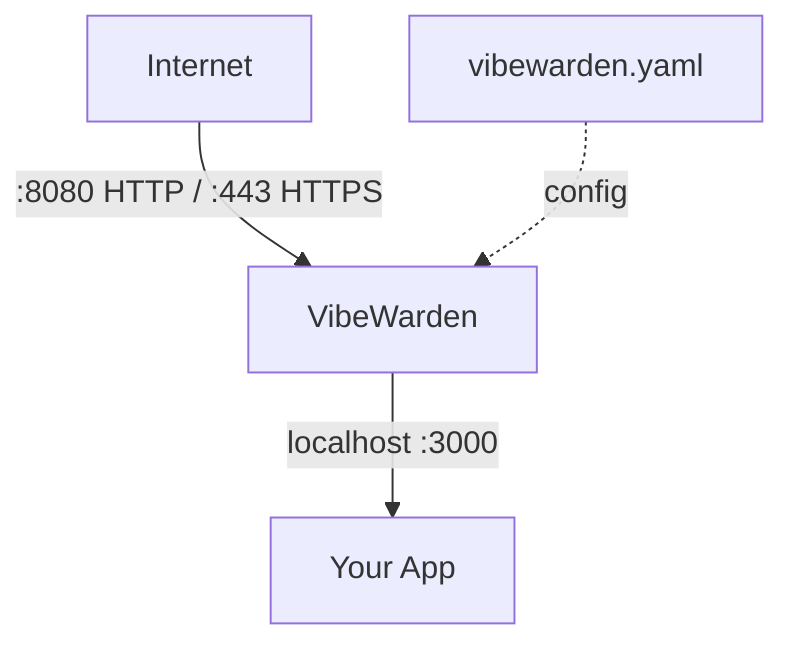
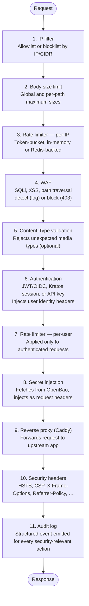
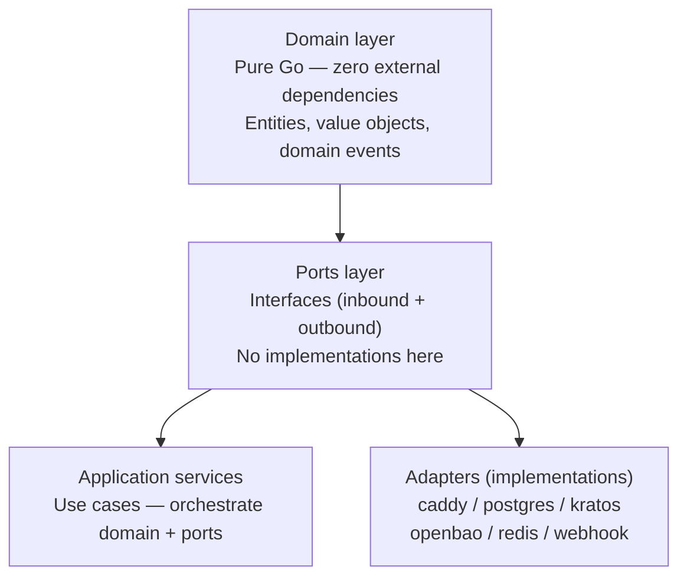

# Architecture

VibeWarden is a local security sidecar built in Go. It embeds Caddy as a
reverse-proxy engine and adds a middleware chain on top of it. This page describes
the middleware stack, the plugin system, the hexagonal architecture that structures
the codebase, and how Caddy is embedded.

---

## Sidecar model

VibeWarden always runs **on the same machine as your app**. It is never hosted
on a remote server.



The sidecar intercepts all inbound traffic, applies the configured middleware
chain, and forwards clean requests to the app. Outbound requests made by your
app can optionally route through the egress proxy for SSRF protection and PII
redaction.

---

## Middleware stack

Every inbound request passes through the following ordered chain:



Plugins that are disabled in `vibewarden.yaml` are skipped entirely — no
handler is registered.

---

## Plugin system

All features in VibeWarden are implemented as plugins. Plugins are compiled into
the binary and activated by configuration. There is no dynamic loading or external
plugin API.

### Plugin lifecycle

1. **Registration**: each plugin registers itself with the plugin registry at
   import time (via `init()`).
2. **Configuration loading**: the config loader reads `vibewarden.yaml` and
   populates the plugin's config struct.
3. **Validation**: `Config.Validate()` checks the plugin's config for consistency.
4. **Initialization**: `plugins.Start()` initializes each enabled plugin in
   dependency order.
5. **Shutdown**: `plugins.Stop()` gracefully shuts down each plugin in reverse
   order.

### Available plugins

| Plugin | Config key | Description |
|--------|-----------|-------------|
| TLS | `tls` | Certificate provisioning via Caddy (Let's Encrypt, self-signed, external) |
| Auth | `auth` | JWT/OIDC, Kratos session, or API key authentication |
| Rate limiting | `rate_limit` | Token-bucket rate limiting (in-memory or Redis) |
| WAF | `waf` | SQL injection, XSS, path traversal detection |
| Security headers | `security_headers` | HSTS, CSP, X-Frame-Options, and more |
| CORS | `cors` | Cross-Origin Resource Sharing headers |
| Secrets | `secrets` | OpenBao integration — inject secrets as headers or env vars |
| Egress proxy | `egress` | Outbound HTTP control with SSRF protection |
| Observability | `observability` | Prometheus, Grafana, Loki, Promtail Compose stack (start with `vibew obs up`) |
| Resilience | `resilience` | Circuit breaker, retry, and timeout middleware |
| IP filter | `ip_filter` | IP address allowlist / blocklist |
| Body size | `body_size` | Per-request body size enforcement |
| Webhooks | `webhooks` | HMAC-signed audit event delivery |
| Admin API | `admin` | User management endpoints |

> **Planned / Pro-tier (not yet implemented):** The **Fleet** plugin (`fleet`) will
> bridge telemetry to `app.vibewarden.dev` as the VibeWarden Pro tier feature.
> It is a locked-decision roadmap item and is not available in the current binary.
> See [CLAUDE.md locked decisions](https://github.com/vibewarden/vibewarden/blob/main/CLAUDE.md) for context.

---

## Hexagonal architecture

VibeWarden's codebase is organized around the hexagonal architecture (ports and
adapters) pattern combined with domain-driven design (DDD).



### Directory layout

```
cmd/
  vibewarden/         # CLI entrypoint (cobra commands)

internal/
  domain/             # Entities, value objects, domain events
                      # Zero external dependencies — pure Go + stdlib only

  ports/              # Interfaces (inbound + outbound)
                      # Defined here, implemented in adapters/

  adapters/
    caddy/            # Caddy embedding adapter
    kratos/           # Ory Kratos adapter
    postgres/         # PostgreSQL adapter
    log/              # Log sink adapters (stdout, file, webhook)
    ratelimit/        # Rate-limit store adapters (in-memory + Redis)
    openbao/          # OpenBao secrets adapter

  app/                # Application services (use cases)
                      # Orchestrate domain + ports; no business logic

  config/             # Config loading and validation (viper + mapstructure)
  plugins/            # Plugin registry and lifecycle management

migrations/           # SQL migration files (golang-migrate)

docs/                 # Documentation
```

### Dependency rules

1. **Domain layer** imports nothing outside the Go standard library and the
   `internal/domain` package itself.
2. **Ports layer** imports only the domain layer.
3. **Application services** import domain and ports. They never import adapters
   directly.
4. **Adapters** import ports (the interfaces they implement) and external
   libraries. They never import application services.
5. **`cmd/vibewarden`** is the composition root. It is the only package allowed
   to import everything and wire it together.

---

## Caddy embedding

VibeWarden uses Caddy as its HTTP server and reverse-proxy engine. Caddy is
embedded as a Go library — there is no `Caddyfile` and no Caddy process. All
configuration is programmatic via Caddy's admin API data structures.

### Why Caddy

- Apache 2.0 license (compatible with VibeWarden's Apache 2.0 license)
- Built-in ACME / Let's Encrypt support
- Programmatic configuration without a config file
- Mature TLS stack with automatic certificate renewal
- High-performance HTTP/1.1, HTTP/2, and HTTP/3 support

### How it is wired

At startup:

1. `internal/adapters/caddy/` builds a Caddy JSON config from `Config`.
2. The config describes a single HTTP app with one route: forward all requests
   to the upstream after passing through the middleware handlers.
3. Middleware handlers are Go `http.Handler` chains registered programmatically.
4. Caddy is started via `caddy.Run()` with the constructed config.

On config reload (e.g., `vibew generate`):

1. The new config is built from the updated `vibewarden.yaml`.
2. Caddy's admin API receives the new config via `caddy.Load()` — no process
   restart required.

---

## AI-readable structured logs

Every security-relevant event produces a structured JSON log record:

```json
{
  "schema_version": "v1",
  "event_type": "auth.success",
  "timestamp": "2026-03-28T12:00:00Z",
  "ai_summary": "Authenticated request allowed: GET /api/users (identity usr_abc123)",
  "severity": "info",
  "category": "auth",
  "actor": {
    "type": "user",
    "id":   "usr_abc123",
    "ip":   "203.0.113.42"
  },
  "resource": {
    "type":   "http_endpoint",
    "path":   "/api/users",
    "method": "GET"
  },
  "outcome":      "allowed",
  "triggered_by": "auth_middleware",
  "payload": {
    "method":   "GET",
    "path":     "/api/users",
    "identity_id": "usr_abc123"
  }
}
```

The schema is published at `vibewarden.dev/schema/v1/event.json`. Schema
stability is treated with the same care as a public API — breaking changes
require a new `schema_version` value.

### Event types

The table below lists the most commonly observed event types. For the full
authoritative list — including payload schemas, severity levels, and example
events — see [AI-Readable Log Schema](ai-log-schema.md).

| Event type | Description |
|------------|-------------|
| `proxy.started` | Reverse proxy started and is ready to accept connections |
| `auth.success` | Valid session or credential — request allowed through |
| `auth.failed` | Missing, invalid, or expired credential — request rejected |
| `rate_limit.hit` | Per-IP or per-user rate limit exceeded — request rejected |
| `rate_limit.store_fallback` | Redis unavailable — rate limiter switched to in-memory store |
| `rate_limit.store_recovered` | Redis available again — rate limiter switched back from in-memory |
| `request.blocked` | Request blocked by a middleware policy (WAF, maintenance mode, etc.) |
| `secret.rotated` | Dynamic secret rotated successfully |
| `secret.rotation_failed` | Dynamic secret rotation failed; old credentials remain active |
| `upstream.timeout` | Upstream did not respond within configured timeout; 504 returned |
| `upstream.retry` | Retry middleware re-sending a failed upstream request |
| `upstream.health_changed` | Upstream health status transitioned (unknown → healthy → unhealthy) |
| `tls.certificate_issued` | TLS certificate obtained or renewed |
| `config.reloaded` | Configuration reloaded and applied successfully |
| `config.reload_failed` | Configuration reload failed; old config remains active |

### Log sinks

| Sink | Config |
|------|--------|
| Standard output (JSON) | Always active — cannot be disabled |
| File (JSONL) | `audit.output: /var/log/vibewarden/audit.jsonl` |
| OTLP (Loki via OTel Collector) | `telemetry.logs.otlp: true` |
| Webhook (HMAC-signed) | `webhooks.endpoints[].events` |
