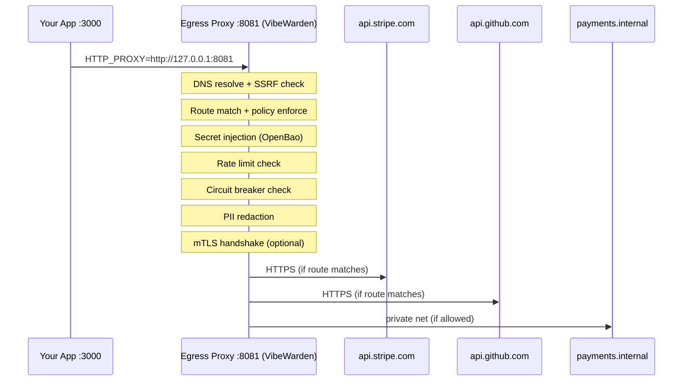
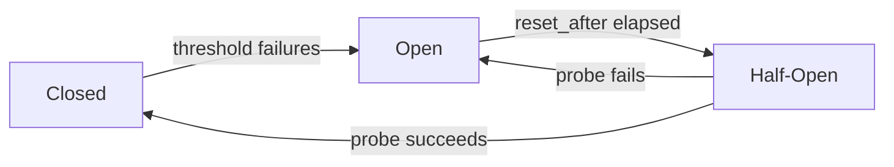

# Egress Proxy

VibeWarden includes an egress proxy that sits between your app and the external
APIs it calls. Your app sends outbound HTTP requests to the proxy instead of
directly to the internet. The proxy applies allowlisting, secret injection, rate
limiting, circuit breaking, retries, PII redaction, response validation, caching,
and full structured-event observability — all without any code changes to your app.

**Why use it?**

- **Your app never holds external secrets.** API keys are fetched from OpenBao at
  request time and injected by the proxy. They never touch your app's memory or
  environment.
- **SSRF protection.** The proxy resolves DNS and blocks requests to RFC 1918
  private addresses and loopback ranges by default, preventing server-side
  request forgery attacks.
- **Observability.** Every outbound request, response, block, and error is emitted
  as a structured AI-readable event with `schema_version`, `event_type`,
  `ai_summary`, and `payload`.

---

## Architecture



In transparent mode the app sets the `HTTP_PROXY` environment variable and all
outbound HTTP calls go through the proxy automatically. In named-route mode the
app addresses routes directly via `/_egress/{route-name}/path`.

---

## Quick Start

1. Enable the egress proxy in `vibewarden.yaml`:

```yaml
egress:
  enabled: true
  listen: "127.0.0.1:8081"
  default_policy: deny

  dns:
    block_private: true

  routes:
    - name: stripe-api
      pattern: "https://api.stripe.com/**"
      methods: ["POST"]
      timeout: "10s"
      secret: app/stripe
      secret_header: Authorization
      secret_format: "Bearer {value}"
```

2. Point your app at the proxy:

```bash
export HTTP_PROXY=http://127.0.0.1:8081
```

3. Make your API calls as normal:

```bash
# Your app calls Stripe — the proxy injects the Bearer token automatically
curl -X POST http://127.0.0.1:8081/v1/charges \
  -H "X-Egress-URL: https://api.stripe.com/v1/charges" \
  -d '{"amount":1000,"currency":"usd","source":"tok_visa"}'
```

---

## Routing Modes

### Transparent mode (X-Egress-URL header)

The app sends all outbound requests to the proxy address and sets the
`X-Egress-URL` header to the real target URL. This is the easiest integration:
set `HTTP_PROXY` once and all HTTP libraries route through the proxy automatically.

```
POST http://127.0.0.1:8081/
X-Egress-URL: https://api.stripe.com/v1/charges
Content-Type: application/json
```

The proxy strips `X-Egress-URL` before forwarding the request upstream.

### Named-route mode (/_egress/{route})

The app addresses the route directly by name:

```
POST http://127.0.0.1:8081/_egress/stripe-api/v1/charges
Content-Type: application/json
```

The proxy maps `stripe-api` to the configured route, strips the `/_egress/stripe-api`
prefix, and forwards `/v1/charges` to `https://api.stripe.com/v1/charges`.

---

## Default Deny Policy

When `default_policy: deny` is set (the default), any outbound request that does
not match a configured route is blocked with `403 Forbidden` and an
`egress.blocked` structured event is emitted.

To allow all unmatched requests to pass through without restriction, set
`default_policy: allow`. This is not recommended for production — it disables
the allowlisting protection.

---

## Features

### SSRF Protection

The proxy resolves all destination hostnames and rejects requests that resolve to
private, loopback, or reserved IP ranges. This prevents SSRF attacks where
user-supplied URLs could target internal infrastructure.

```yaml
egress:
  dns:
    block_private: true          # default: true
    allowed_private:             # exempt specific CIDRs when running inside a private net
      - "10.0.0.0/8"
      - "192.168.100.0/24"
```

Blocked requests emit an `egress.blocked` event with `reason: "private IP blocked"`.

---

### Secret Injection

The proxy fetches a secret from OpenBao at request time and injects it as an HTTP
request header. The secret is never stored in your app or its environment. The
secrets plugin must be enabled and configured separately — see
[Secret Management](secret-management.md).

```yaml
routes:
  - name: stripe-api
    pattern: "https://api.stripe.com/**"
    secret: app/stripe            # OpenBao KV path
    secret_header: Authorization  # header to inject into
    secret_format: "Bearer {value}"  # {value} is replaced with the secret
```

The `secret_format` template replaces `{value}` with the secret fetched from
OpenBao. Common formats:

| Provider | secret_header | secret_format |
|----------|---------------|---------------|
| Stripe | `Authorization` | `Bearer {value}` |
| GitHub | `Authorization` | `token {value}` |
| Twilio | `Authorization` | `Basic {value}` |
| Custom | Any header name | `{value}` |

---

### Rate Limiting

Per-route token-bucket rate limiting. The expression format is
`<count>/<unit>` where unit is `s` (seconds), `m` (minutes), or `h` (hours).

```yaml
routes:
  - name: github-api
    pattern: "https://api.github.com/**"
    rate_limit: "500/m"   # 500 requests per minute
```

When the limit is exceeded the proxy returns `429 Too Many Requests` and emits
an `egress.rate_limit_hit` event.

---

### Circuit Breaker

The circuit breaker protects your app from cascading failures when an upstream
service becomes unavailable. After `threshold` consecutive failures the circuit
opens and all requests to that route are short-circuited with `503 Service
Unavailable` until `reset_after` elapses, at which point a single probe request
is allowed through.

```yaml
routes:
  - name: stripe-api
    pattern: "https://api.stripe.com/**"
    circuit_breaker:
      threshold: 5       # open after 5 consecutive failures
      reset_after: "30s" # probe after 30 seconds
```

State transitions:



Structured events emitted:

- `egress.circuit_breaker.opened` — circuit tripped, upstream blocked
- `egress.circuit_breaker.closed` — upstream recovered, traffic flowing

---

### Retries

The proxy retries failed requests with backoff. Only idempotent methods (`GET`,
`HEAD`, `PUT`, `DELETE`) are retried by default. Non-idempotent methods (`POST`,
`PATCH`) must be explicitly listed in `methods` to be retried.

```yaml
routes:
  - name: stripe-api
    pattern: "https://api.stripe.com/**"
    retries:
      max: 3                  # up to 3 retry attempts (4 total)
      backoff: exponential    # "exponential" (default) or "fixed"
      methods: ["GET"]        # restrict to safe methods only
```

Retryable status codes: `408`, `429`, `500`, `502`, `503`, `504`.

The response header `X-Egress-Attempts` reports the total number of upstream
attempts made (initial + retries).

---

### TLS Enforcement

By default the proxy only forwards requests to `https://` destinations. Plain
HTTP targets are rejected with `400 Bad Request` and an `egress.blocked` event.

To allow HTTP globally:

```yaml
egress:
  allow_insecure: true
```

To allow HTTP for a specific route only:

```yaml
routes:
  - name: internal-service
    pattern: "http://internal.svc/**"
    allow_insecure: true
```

---

### mTLS (Mutual TLS)

For upstreams that require client certificate authentication, configure the
client certificate and key per route. An optional CA certificate can be provided
to verify the server's certificate instead of using the system root CA pool.

```yaml
routes:
  - name: payment-processor
    pattern: "https://payments.example.com/**"
    mtls:
      cert_path: "/etc/vibewarden/certs/client.crt"
      key_path:  "/etc/vibewarden/certs/client.key"
      ca_path:   "/etc/vibewarden/certs/payments-ca.crt"  # optional
```

| Field | Description |
|-------|-------------|
| `cert_path` | Path to PEM-encoded client certificate |
| `key_path` | Path to PEM-encoded private key |
| `ca_path` | Path to PEM-encoded CA bundle (optional; uses system roots when empty) |

---

### Request and Response Headers

Inject static headers into every outbound request, strip internal request headers
before forwarding, and strip fingerprinting headers from upstream responses.
`Server` and `X-Powered-By` are always stripped from responses regardless of
per-route configuration.

```yaml
routes:
  - name: analytics-api
    pattern: "https://analytics.example.com/**"
    headers:
      inject:                        # add/overwrite request headers before forwarding
        X-App-Name: "my-app"
        X-Forwarded-By: "vibewarden"
      strip_request:                 # remove before forwarding upstream
        - Cookie
        - X-Internal-Token
      strip_response:                # remove from upstream response
        - X-Debug-Info
        - X-Request-Id
```

---

### PII Redaction (sanitize)

The `sanitize` rules protect sensitive data in three ways:

1. **Headers** — header values are replaced with `[REDACTED]` in structured log
   events. The actual forwarded request is unchanged.
2. **Query params** — named query parameters are stripped from the URL before the
   request is forwarded upstream. They never reach the external service.
3. **Body fields** — named JSON fields are replaced with `[REDACTED]` in the
   request body before forwarding. Only applies when `Content-Type` is
   `application/json`.

```yaml
routes:
  - name: crm-api
    pattern: "https://crm.example.com/**"
    sanitize:
      headers:
        - Authorization      # log: [REDACTED], forwarded: intact
        - Cookie
      query_params:
        - api_key            # stripped from URL before forwarding
        - token
      body_fields:
        - password           # replaced with [REDACTED] in JSON body
        - ssn
        - card_number
```

An `egress.sanitized` event is emitted reporting counts of redacted headers,
stripped query params, and redacted body fields.

---

### Body and Response Size Limits

Protect against oversized payloads in both directions. Requests exceeding
`body_size_limit` are rejected with `413 Request Entity Too Large`. Responses
exceeding `response_size_limit` are truncated and the `X-Egress-Response-Truncated`
header is added to the response.

Set global defaults and override per route:

```yaml
egress:
  default_body_size_limit: "10MB"      # global default for all routes
  default_response_size_limit: "50MB"  # global default for all routes

  routes:
    - name: file-upload-api
      pattern: "https://storage.example.com/**"
      body_size_limit: "100MB"          # override for this route
      response_size_limit: "200MB"
```

---

### Response Caching

In-memory caching for `GET` and `HEAD` requests that receive a `2xx` response.
Subsequent identical requests are served from cache without contacting the
upstream. The `X-Egress-Cache` response header reports `HIT` or `MISS`.

```yaml
routes:
  - name: reference-data-api
    pattern: "https://reference.example.com/**"
    cache:
      enabled: true
      ttl: "5m"          # evict after 5 minutes
      max_size: 1048576  # skip caching responses larger than 1 MB (bytes)
```

| Field | Type | Description |
|-------|------|-------------|
| `enabled` | bool | Activate response caching for this route |
| `ttl` | duration | How long a cached entry remains valid. Zero means never expire (not recommended) |
| `max_size` | int | Maximum cached response body size in bytes. Zero means no per-entry size limit |

---

### Response Validation

Validate upstream responses before returning them to your app. When a response
fails validation the proxy drops it and returns `502 Bad Gateway`. This prevents
your app from processing unexpected response formats silently.

```yaml
routes:
  - name: payments-api
    pattern: "https://pay.example.com/**"
    validate_response:
      status_codes:
        - "2xx"     # any 2xx
        - "301"     # redirect
        - "302"
      content_types:
        - "application/json"
```

Status code expressions: exact code (`"200"`, `"404"`) or class wildcard
(`"2xx"`, `"3xx"`, `"4xx"`, `"5xx"`).

When validation fails, an `egress.response_invalid` event is emitted with the
actual status code, content type, and rejection reason.

---

## Structured Events Reference

All egress events follow the VibeWarden AI-readable schema
(`schema_version`, `event_type`, `timestamp`, `ai_summary`, `payload`).

| Event type | When emitted | Key payload fields |
|---|---|---|
| `egress.request` | Proxy begins forwarding an outbound request | `route`, `method`, `url`, `trace_id` |
| `egress.response` | Proxy receives a complete upstream response | `route`, `method`, `url`, `status_code`, `duration_seconds`, `attempts`, `trace_id` |
| `egress.blocked` | Request blocked by policy or security rule | `route`, `method`, `url`, `reason`, `trace_id` |
| `egress.error` | Transport-level failure (timeout, DNS, refused) | `route`, `method`, `url`, `error`, `attempts`, `trace_id` |
| `egress.circuit_breaker.opened` | Circuit tripped after consecutive failures | `route`, `threshold`, `timeout_seconds` |
| `egress.circuit_breaker.closed` | Circuit closed after successful probe | `route` |
| `egress.rate_limit_hit` | Per-route rate limit exceeded | `route`, `limit`, `retry_after_seconds` |
| `egress.response_invalid` | Upstream response failed `validate_response` rules | `route`, `method`, `url`, `status_code`, `content_type`, `reason`, `trace_id` |
| `egress.sanitized` | PII redaction rules applied to outbound request | `route`, `method`, `url`, `redacted_headers`, `stripped_query_params`, `redacted_body_fields`, `total_redacted`, `trace_id` |

---

## Complete Example

A full `vibewarden.yaml` egress section with three routes:

```yaml
egress:
  enabled: true
  listen: "127.0.0.1:8081"
  default_policy: deny
  allow_insecure: false
  default_timeout: "30s"
  default_body_size_limit: "10MB"
  default_response_size_limit: "50MB"

  dns:
    block_private: true
    allowed_private: []

  routes:
    # Stripe — POST only, secret injection, circuit breaker, retries
    - name: stripe-api
      pattern: "https://api.stripe.com/**"
      methods: ["POST"]
      timeout: "10s"
      secret: app/stripe
      secret_header: Authorization
      secret_format: "Bearer {value}"
      rate_limit: "100/s"
      circuit_breaker:
        threshold: 5
        reset_after: "30s"
      retries:
        max: 3
        backoff: exponential
      validate_response:
        status_codes: ["2xx"]
        content_types: ["application/json"]
      sanitize:
        headers:
          - Authorization
        body_fields:
          - card_number
          - cvc

    # GitHub — GET and POST, rate limited, response caching for GETs
    - name: github-api
      pattern: "https://api.github.com/**"
      methods: ["GET", "POST"]
      timeout: "15s"
      rate_limit: "500/m"
      headers:
        inject:
          Accept: "application/vnd.github+json"
          X-GitHub-Api-Version: "2022-11-28"
      cache:
        enabled: true
        ttl: "5m"
        max_size: 524288   # 512 KB

    # Internal payment service — private network, mTLS
    - name: internal-payments
      pattern: "https://payments.internal/**"
      allow_insecure: false
      mtls:
        cert_path: "/etc/vibewarden/certs/client.crt"
        key_path:  "/etc/vibewarden/certs/client.key"
        ca_path:   "/etc/vibewarden/certs/internal-ca.crt"
      dns:
        # Override: allow this route to reach a private network address.
        # Must also add the CIDR to egress.dns.allowed_private above.
```

!!! note "DNS exemption for internal routes"
    To reach a private-network host, add its CIDR to `egress.dns.allowed_private`
    at the top level and set `allow_insecure: false` (or use HTTPS with `mtls`).
    Setting `egress.dns.block_private: false` disables SSRF protection entirely
    and is not recommended.

---

## Troubleshooting

### "request blocked: no route matched"

The outbound URL does not match any configured route and `default_policy` is
`deny`. Options:

- Add a route whose `pattern` matches the URL.
- Set `default_policy: allow` to pass unmatched requests through (removes
  allowlist protection — use only in development).

### "plain HTTP not allowed"

The target URL uses `http://` and neither `egress.allow_insecure` nor the matched
route's `allow_insecure` is `true`. Options:

- Change the target URL to `https://`.
- Set `allow_insecure: true` on the specific route.
- Set `egress.allow_insecure: true` globally (not recommended for production).

### "circuit breaker is open"

The upstream service returned too many consecutive errors and the circuit tripped.
The proxy is short-circuiting requests with `503` until `reset_after` elapses.

- Check the upstream service health.
- Wait for the `reset_after` duration. The proxy will send one probe request to
  test recovery.
- An `egress.circuit_breaker.opened` event in the audit log shows when the
  circuit tripped and the `timeout_seconds` remaining.

### "rate limit exceeded"

The route's `rate_limit` budget has been exhausted. The response includes a
`Retry-After` header. Either reduce request frequency or raise the limit.

### Secret injection not working

- Ensure the `secrets` plugin is enabled and the OpenBao address is reachable.
- Verify the `secret` field matches an existing KV path in OpenBao.
- Check the audit log for `secrets.*` events indicating fetch failures.
- Secrets are cached; a stale cache entry may be served for up to `secrets.cache_ttl`.

### Responses are being truncated

The upstream response body exceeded `response_size_limit`. The response contains
`X-Egress-Response-Truncated: true`. Raise `response_size_limit` on the route or
at the global `egress.default_response_size_limit` level.

### mTLS handshake failed

- Verify `cert_path` and `key_path` point to valid, matching PEM files.
- Confirm the certificate has not expired.
- If the upstream uses a private CA, set `ca_path` to the CA bundle.
- Check that the upstream server is configured to accept client certificates.
