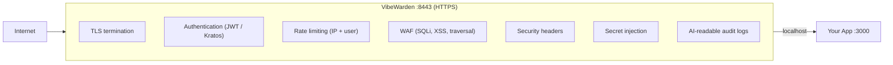

<p align="center">
  
</p>

**Production-grade security for vibe-coded apps — no changes to your app code.**

You ship fast with AI coding tools. VibeWarden adds the security layer you skipped:
TLS, authentication, rate limiting, WAF, secrets management, and AI-readable audit logs —
all in a single binary that sits next to your app.

---

## Quick Start

=== "macOS / Linux"

    ```bash
    # Download the vibew wrapper
    curl -fsSL https://vibewarden.dev/vibew > vibew && chmod +x vibew

    # Scaffold VibeWarden into your project (auth + rate limiting enabled)
    ./vibew init --upstream 3000 --auth --rate-limit

    # Start everything
    ./vibew dev
    ```

=== "Windows"

    ```powershell
    Invoke-WebRequest -Uri https://vibewarden.dev/vibew.ps1 -OutFile vibew.ps1
    .\vibew.ps1 init --upstream 3000 --auth --rate-limit
    .\vibew.ps1 dev
    ```

Your app on port 3000 is now behind VibeWarden at `https://localhost:8443`. Done.

---

## How It Works



VibeWarden is a **local sidecar** — it always runs on the same machine as your app.
It is never hosted remotely.

---

## Feature Matrix

| Feature | Details |
|---------|---------|
| Reverse proxy | Embedded [Caddy](https://caddyserver.com/) — programmatic config, no Caddyfile |
| TLS | Let's Encrypt (prod), self-signed (dev), or external (Cloudflare, ACM, …) |
| Authentication | `none`, `jwt` (any OIDC provider), `kratos` (self-hosted), `api-key` |
| Rate limiting | Token-bucket, per-IP and per-user; in-memory or Redis-backed |
| WAF | Pattern detection for SQLi, XSS, path traversal; `block` or `detect` mode |
| Security headers | HSTS, CSP, X-Frame-Options, Referrer-Policy, Permissions-Policy, CORS |
| Secrets management | OpenBao (Apache 2.0 Vault fork) — inject secrets as headers or env vars |
| Egress proxy | Outbound HTTP with mTLS, circuit breaker, retry, SSRF protection, PII redaction |
| Resilience | Circuit breaker, retry with jitter, timeout middleware, aggregate health endpoint |
| Observability | Prometheus metrics, OpenTelemetry traces + logs, Grafana dashboards, Jaeger/Tempo |
| AI-readable logs | Versioned JSON schema: `schema_version`, `event_type`, `ai_summary`, `payload` |
| Audit log sinks | JSON file, OTel logs, webhook (HMAC-signed) with retry |
| Admin API | User management at `/_vibewarden/admin/*` (bearer-token protected) |
| Docker Compose | Profile-based: `--profile observability`, `--profile demo` |

---

## Authentication Modes

| Mode | When to use |
|------|-------------|
| `none` | Fully public apps |
| `jwt` | Any OIDC provider — Auth0, Keycloak, Firebase, Cognito, Okta, Supabase, … |
| `kratos` | Self-hosted identity with login / registration UI via Ory Kratos |
| `api-key` | Machine-to-machine requests |

The `jwt` mode works with any OIDC-compatible provider:

```yaml
auth:
  mode: jwt
  jwt:
    jwks_url: "https://your-provider/.well-known/jwks.json"
    issuer:   "https://your-provider/"
    audience: "your-api-identifier"
  public_paths:
    - /static/*
    - /health
```

Your app receives authenticated user info via headers:

| Header | Source claim | Description |
|--------|--------------|-------------|
| `X-User-Id` | `sub` | Subject identifier |
| `X-User-Email` | `email` | Primary email address |
| `X-User-Verified` | `email_verified` | Email verification status (`true`/`false`) |

---

## Comparison with Alternatives

| | VibeWarden | nginx | Traefik | Cloudflare Tunnel |
|--|--|--|--|--|
| Target user | Vibe coders / indie devs | Ops / sysadmin | Container-native teams | Any |
| Setup time | 3 commands | Hours of config | Moderate | Minutes |
| Auth out of the box | Yes (OIDC, Kratos, API key) | No | Partial (forward auth only) | No |
| WAF | Yes | Paid (NGINX Plus) | No | Paid (Cloudflare WAF) |
| Secrets management | Yes (OpenBao) | No | No | No |
| AI-readable audit logs | Yes (versioned schema) | No | No | No |
| Egress proxy + SSRF guard | Yes | No | No | No |
| Self-hosted | Yes | Yes | Yes | No |
| Open source | Apache 2.0 | BSD-2 core | Apache 2.0 | Proprietary |
| Cost | Free (OSS core) | Free | Free | Free tier + paid |

---

## CLI Reference

| Command | Description |
|---------|-------------|
| `vibew init` | Scaffold VibeWarden into a project |
| `vibew add auth` | Enable authentication |
| `vibew add rate-limit` | Enable rate limiting |
| `vibew add tls --domain example.com` | Enable TLS |
| `vibew add metrics` | Enable Prometheus metrics |
| `vibew generate` | Regenerate `docker-compose.yml` from config |
| `vibew dev` | Start local dev environment |
| `vibew status` | Show health of all components |
| `vibew doctor` | Diagnose common issues |
| `vibew logs` | Pretty-print structured logs |
| `vibew secret get <alias-or-path>` | Read a secret from OpenBao |
| `vibew secret list` | List all managed secret paths |
| `vibew token` | Generate a signed dev JWT for local testing |
| `vibew cert export` | Export the local CA certificate (for curl, Postman, …) |
| `vibew validate` | Validate configuration |
| `vibew context refresh` | Regenerate AI agent context files |

---

## License

Apache 2.0 — see [LICENSE](https://github.com/vibewarden/vibewarden/blob/main/LICENSE).
