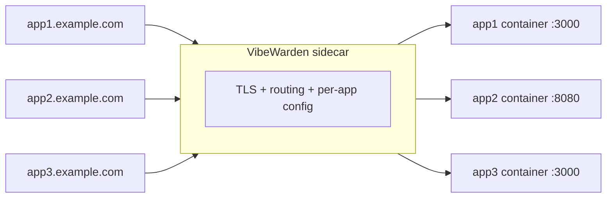

# Multi-App Projects

Multiple apps can coexist in a single VibeWarden project, each with its own
`vibewarden.yaml` under `sites/<name>/`. A shared sidecar reverse-proxies
all of them when the project runs locally.

!!! warning "Multi-site bundle support is deferred"
    `vibew bundle` currently hard-fails on multi-site projects with
    `multi-site bundle is not yet supported`. Remote deployment for
    multi-site layouts is tracked by a follow-up issue and is not part of
    the initial bundle ship ([ADR-085](../decisions/adr-085-vibew-bundle-cli.md),
    [ADR-086](../decisions/adr-086-sunset-vibew-deploy.md)).

    The removed `vibew deploy` command previously orchestrated multi-site
    deployments over SSH. That surface was retired in ADR-086; the
    replacement for multi-site is in-flight under issue #1052 (Helm /
    Fly.io / k8s targets).

    This page documents the **local** multi-app configuration model.
    Single-site remote deployment is covered in
    [Bundle to VPS](guide/bundle-to-vps.md).

---

## When to use this

- **Demo hosting** -- keep `app1.demo.example.com` and
  `app2.demo.example.com` configured side-by-side in one project.
- **Early-stage startup** -- iterate on 2-3 microservices behind a single
  local sidecar before splitting them apart.
- **Side projects** -- one workspace, multiple apps, all sharing one
  VibeWarden sidecar in dev.

---

## How it works

Each app keeps its own `vibewarden.yaml` under `sites/<name>/` -- the same
file you use as a single-app project. When `vibew dev` runs, the sidecar
reads all site configs and generates one Caddy route block per app with
host-based routing.



---

## Project layout

```
my-project/
  vibewarden.yaml            # optional root config (global defaults)
  sites/
    blog/
      vibewarden.yaml        # per-app config
      docker-compose.yml     # per-app container (generated)
    api/
      vibewarden.yaml
      docker-compose.yml
```

- Each `sites/<name>/vibewarden.yaml` is your app's config.
- Each `sites/<name>/docker-compose.yml` is generated from your config.
- No config merging. Each site is independent.

---

## Per-site configuration

Each app's `vibewarden.yaml` is independent and self-contained. Each site
can have its own:

- Auth mode and settings
- Rate limiting configuration
- WAF mode (`block` or `detect`)
- Security headers
- Upstream host and port

Changing one site's config does not affect other sites.

Example site config:

```yaml
# sites/blog/vibewarden.yaml
app:
  image: ghcr.io/your-org/blog:latest

upstream:
  host: app
  port: 3000

tls:
  enabled: true
  provider: letsencrypt
  domain: "blog.example.com"

auth:
  mode: jwt
  jwt:
    jwks_url: "https://your-idp/.well-known/jwks.json"
    issuer: "https://your-idp/"
    audience: "https://api.example.com"

rate_limit:
  enabled: true

waf:
  enabled: true
```

---

## Hot reload

The sidecar watches `sites/*/vibewarden.yaml` for changes. When a config
file is added, modified, or removed, the sidecar reloads the affected
site's Caddy routes without dropping connections to other sites.

Changes are debounced (500ms per site) to handle editors that write files
in multiple steps.

---

## Error isolation

A broken config in one site does not take down other sites:

- If `sites/api/vibewarden.yaml` has a syntax error, the `api` site is
  marked as errored. The `blog` site continues serving normally.
- Fix the config file and the sidecar automatically reloads the
  corrected site.

---

## TLS (when deployed)

For single-site deployments, Caddy auto-provisions a TLS certificate for
each site's domain via ACME (Let's Encrypt). Each site can use a different
TLS provider:

```yaml
# Site A: Let's Encrypt
tls:
  enabled: true
  provider: letsencrypt
  domain: "blog.example.com"

# Site B: self-signed (for staging)
tls:
  enabled: true
  provider: self-signed
  domain: "staging.example.com"
```

DNS A records for all subdomains must point to the host's IP before
deploying.

---

## Limitations

- **Multi-site bundle**: `vibew bundle` rejects multi-site projects today
  (see banner above). Tracked as a follow-up.
- **Shared Kratos**: each site runs its own auth config. A shared Kratos
  instance across sites is deferred.
- **Migration tooling**: no automated conversion from a single-app
  project to multi-app layout.
- **App removal**: no first-class `remove` command. Delete the
  `sites/<name>/` directory and restart the sidecar.

---

## Related

- [Bundle to VPS](guide/bundle-to-vps.md) -- single-site deploy walkthrough
- [Removed `vibew deploy`](deploy-reference.md) -- breaking-change landing
- [Configuration](configuration.md) -- `vibewarden.yaml` field reference
- [ADR-086](../decisions/adr-086-sunset-vibew-deploy.md) -- sunset rationale
